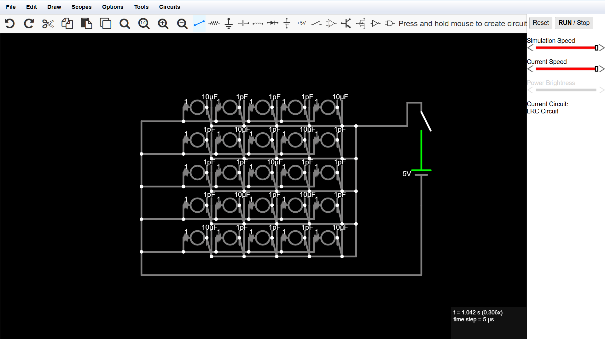
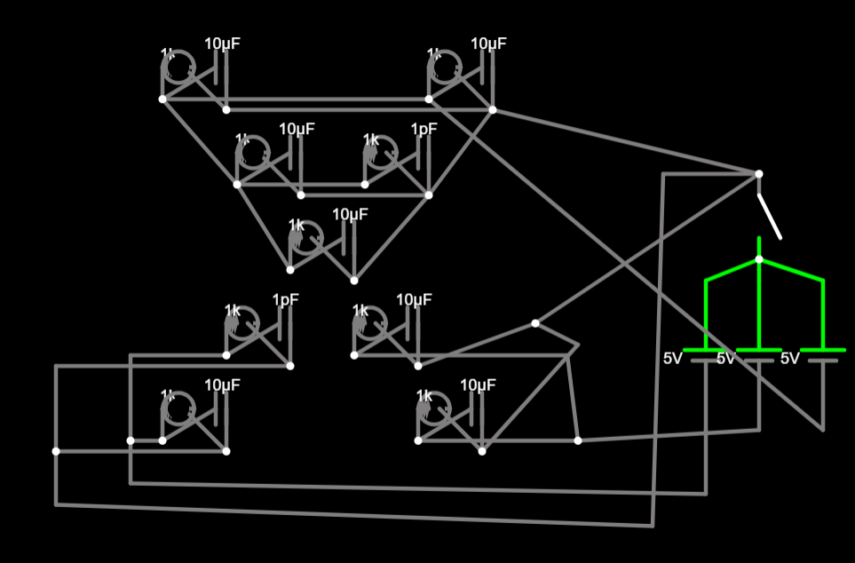
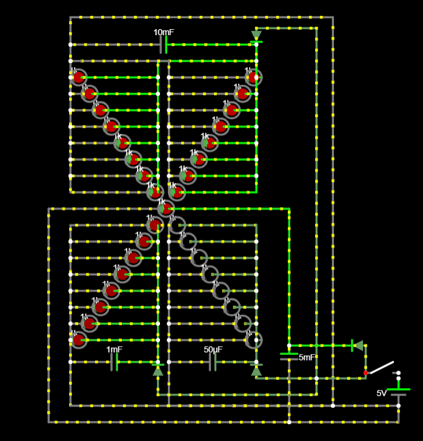

# Fading Led Screen

The goal of this project is to build an LED screen using only capacitors and resistors. When turned off, the LEDs should fade in the following order: X → Y → V → dot.

## 31/3/26 - Initial Design

Today, I attempted to create a 5x5 LED grid, with each LED connected to its own capacitor and resistor. However, I noticed that all the LEDs were fading simultaneously, even though each was paired with a different size capacitor. I discovered that this issue arose because the current was flowing to each LED from every capacitor, as they were all interconnected through the parallel connection.

I then tried using different batteries, but the LEDs remained interconnected. At this point, I decided to pause the project for the day and continue tomorrow.

### Time Spent: 1.25 Hours

## 2/4/26 - Final Design

After some research on Google, I found that I could resolve the issue by using diodes and grouping the LEDs so that all LEDs in one group would fade out together. I created an "X" shape with seven LEDs to test this method, and it was successful.

Following that, I added more LEDs and arranged them in a more symmetrical way to enhance their appearance. However, I did not create a complete screen because the number of wires connecting the LEDs in different groups made it look cluttered.

### Time Spent: 0.75 Hours
